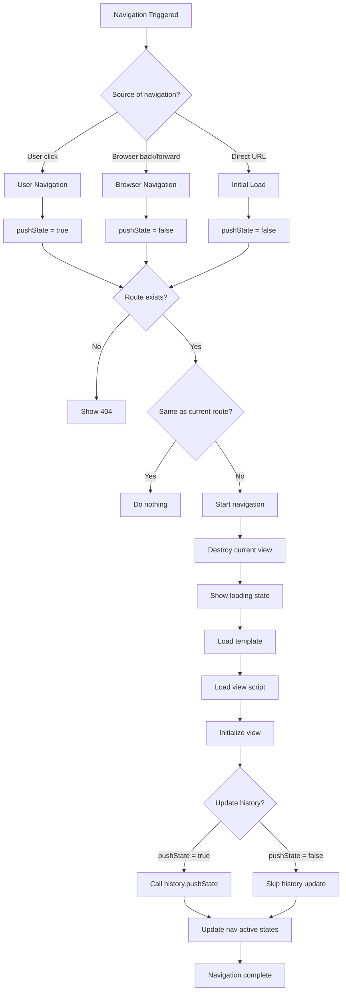

# Architecture Overview

This document explains how the web native routing system works at a high level. Understanding this architecture will help you navigate the codebase and extend the system for your own projects.

## Core Philosophy

This project demonstrates **client-side routing using only native web APIs** - no frameworks, no build tools, no dependencies. The goal is to show how modern browsers can handle single-page application routing with vanilla JavaScript.

Key principles:
- **Web standards first**: Use native APIs (History API, Fetch API, ES6 modules)
- **JavaScript required**: This is a client-side SPA that needs JavaScript enabled to function
- **Explicit configuration**: Use clear configuration over auto-detection for deployment flexibility

## What is Client-Side Routing?

In a traditional website, when you click a link to go from the homepage to the "About" page, your browser:
1. Makes a request to the server for `/about.html`
2. Downloads the entire new page
3. Refreshes the browser window with the new content

**Client-side routing** changes this. Instead, when you click a navigation link:
1. JavaScript intercepts the click
2. Updates the page content without refreshing
3. Changes the URL to match the new "page"

The result feels faster and smoother because there's no page refresh, but the URL still changes properly so the back button works and you can bookmark or share links.

## Basic System Flow

Here's the simple version of what happens when someone navigates in this app:


### Breaking It Down

1. **User clicks navigation**: Any link with `data-route` attribute
2. **JavaScript intercepts**: Prevents normal browser navigation
3. **Load new content**: Fetches HTML template and runs any page-specific code
4. **Update URL**: Changes browser address bar to match new "page"
5. **Page appears changed**: User sees new content, URL updated, back button works

This creates the illusion of multiple pages while actually staying on the same `index.html` the entire time.

## Directory Structure

The project uses a **view-based directory structure** where each route corresponds to a folder:

```
web_native_routing/
├── index.html              # Main app shell
├── 404.html                # SPA fallback for direct URLs
├── js/
│   ├── router.js          # Core routing logic
│   ├── app.js             # App initialization
│   ├── config.js          # Deployment configuration
│   └── routes.js          # Route definitions
├── css/
│   └── styles.css         # Application styles
├── scripts/
│   └── build.sh           # Build system for deployment
└── views/                 # One folder per route
    ├── home/
    │   ├── template.html  # HTML content for route
    │   └── script.js      # Optional view-specific logic
    ├── about/
    │   ├── template.html
    │   └── script.js
    └── contact/
        ├── template.html
        └── script.js
```

This structure makes it easy to:
- **Find code** related to a specific page
- **Add new routes** by creating a new folder
- **Organize view-specific assets** together
- **Lazy load** only the code needed for each view

## Navigation Decision Flow

When navigation occurs, the router follows this decision tree:



## Error Handling

The system includes graceful error handling at multiple levels:

- **Route not found**: Show 404 page with navigation back home
- **Template load failure**: Display error message with reload option
- **Script load failure**: Continue with template-only (degraded experience)
- **View initialization failure**: Log error but don't break navigation

## Browser Compatibility

This architecture relies on modern web APIs:

- **History API**: For URL manipulation and browser navigation
- **Fetch API**: For loading templates
- **ES6 Modules**: For dynamic imports and view organization
- **ES6 Classes**: For view structure and lifecycle management

All of these are supported in modern browsers (Chrome 61+, Firefox 60+, Safari 11+, Edge 16+).

## Performance Characteristics

The architecture is optimized for:

- **Fast initial load**: Minimal JavaScript to parse and execute
- **Quick navigation**: Cached templates and scripts reduce latency
- **Memory efficiency**: Proper cleanup prevents memory leaks
- **Network efficiency**: Only loads code needed for current view

## Deployment Configuration

The system uses **explicit base path configuration** to handle different hosting scenarios:

### Base Path Challenge

Different hosting platforms serve static sites from different base paths:
- **Local development**: Usually serves from root `/`
- **GitHub Pages**: Serves from project subdirectory `/repository-name/`
- **Other hosts**: May serve from custom paths

### Solution: Explicit Configuration

Instead of auto-detection (which is complex and error-prone), the system uses explicit configuration:

```javascript
// js/config.js - Single source of truth
export const deploymentConfig = {
    basePath: '/',                      // Local development
    // basePath: '/web_native_routing/', // GitHub Pages
};
```

### Build System

The build system (`scripts/build.sh`) automates deployment:

1. **Copies source files** to `dist/` directory
2. **Modifies config.js** to use deployment base path
3. **Preserves development setup** - source files remain unchanged

### SPA Fallback

The `404.html` file provides SPA fallback for direct URL access:

```javascript
// Redirect direct URLs to app with base path
import { deploymentConfig } from './js/config.js';
sessionStorage.redirect = location.href;
location.replace(deploymentConfig.basePath);
```

This ensures users can bookmark or directly navigate to any route.

## Next Steps

Now that you understand the overall architecture, dive deeper into:

- **[Router Implementation](router-implementation.md)**: How the Router class works internally (includes limitations)
- **[View System](view-system.md)**: Creating and managing views
- **[View Scripts & Interactivity](view-system.md#writing-view-scripts--interactivity)**: Adding behavior to your views
- **[References](references.md)**: Further reading and learning resources

## Summary

This web native routing system demonstrates that modern browsers are capable of sophisticated client-side navigation without frameworks. The architecture balances simplicity with functionality, providing a solid foundation for small to medium-sized applications while remaining educational and approachable for developers learning web fundamentals.
