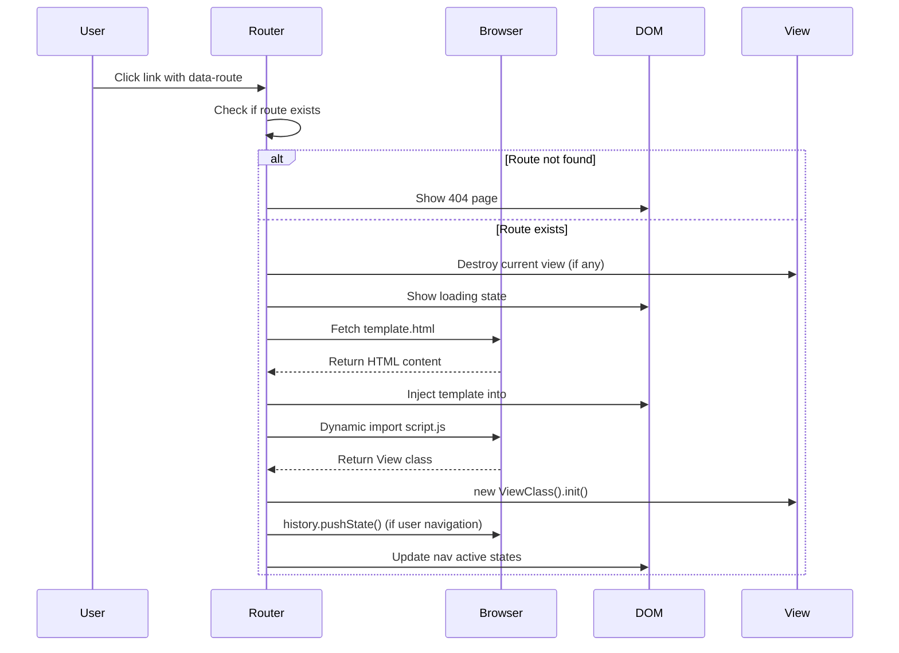
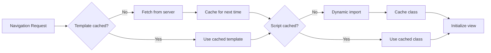

# Router Implementation

This document dives deep into how the `Router` class works internally. If you want to understand the code, extend the router, or debug issues, this is your guide.

## Router Class Overview

The `Router` class is the heart of the routing system. Here's its structure:

```javascript
class Router {
    constructor() {
        this.routes = new Map();           // Route registry
        this.currentRoute = null;          // Current active route
        this.currentView = null;           // Current view instance
        this.contentElement = document.getElementById('content');
        this.cache = new Map();            // Template cache
        this.viewCache = new Map();        // View script cache
    }
}
```

## Detailed Navigation Flow

Here's the complete sequence that happens during navigation:



## Core Methods Breakdown

### 1. Route Registration (`addRoute`)

```javascript
addRoute(path, viewDir) {
    this.routes.set(path, viewDir);
}
```

**What it does**: Maps URL paths to view directory names
**Example**: `router.addRoute('/about', 'about')` maps `/about` URL to `views/about/` folder

**Sample usage from application code**:
```javascript
// js/app.js - Setting up routes during app initialization
document.addEventListener('DOMContentLoaded', () => {
    const router = new Router();

    // Register all your routes
    router.addRoute('/', 'home');           // / → views/home/
    router.addRoute('/about', 'about');     // /about → views/about/
    router.addRoute('/contact', 'contact'); // /contact → views/contact/
    router.addRoute('/products', 'products'); // /products → views/products/
    router.addRoute('/blog', 'blog');       // /blog → views/blog/

    // Initialize the router
    router.init();
});
```

### 2. Navigation (`navigate`)

This is the most complex method. Let's break it down:

**When it's called**:
- **User clicks a navigation link** (with `data-route` attribute)
- **Browser back/forward buttons** are pressed (via `popstate` event)
- **Initial page load** to render the current URL
- **Programmatically** from your application code

**Who calls it**:
- **Click event handler** → `navigate(link.href, { pushState: true })`
- **Popstate event handler** → `navigate(path, { pushState: false })`
- **Initial route handler** → `navigate(location.pathname, { pushState: false })`
- **Your application code** → `router.navigate('/some-path')`

```javascript
async navigate(path, { pushState = true } = {}) {
    // 1. Prevent unnecessary navigation
    if (this.currentRoute === path) return;

    // 2. Check route exists
    const viewDir = this.routes.get(path);
    if (!viewDir) {
        this.show404();
        return;
    }

    try {
        // 3. Show loading state
        this.showLoading();

        // 4. Cleanup current view
        if (this.currentView && typeof this.currentView.destroy === 'function') {
            this.currentView.destroy();
        }
        this.currentView = null;

        // 5. Load template
        await this.loadView(`views/${viewDir}/template.html`);

        // 6. Load view script
        await this.loadViewScript(viewDir);

        // 7. Update browser history (if needed)
        if (pushState && this.currentRoute !== null) {
            history.pushState({ route: path }, '', path);
        }

        // 8. Update state and UI
        this.currentRoute = path;
        this.updateNavigation(path);

    } catch (error) {
        console.error('Navigation error:', error);
        this.showError('Failed to load page content.');
    }
}
```

**Key insights**:
- **`pushState` parameter**: Differentiates user clicks from browser navigation
- **Error handling**: Graceful fallbacks if anything goes wrong
- **View cleanup**: Prevents memory leaks by calling `destroy()`
- **Loading states**: User feedback during async operations

### 3. Template Loading (`loadView`)

Each view's content is stored as an HTML snippet in a separate `template.html` file within the view's directory (e.g., `views/home/template.html`). This method loads that HTML content and injects it into the page's main content area.

```javascript
async loadView(templatePath) {
    // Check cache first
    if (this.cache.has(templatePath)) {
        this.contentElement.innerHTML = this.cache.get(templatePath);
        return;
    }

    // Fetch from server
    const response = await fetch(templatePath);
    if (!response.ok) {
        throw new Error(`Failed to load template: ${response.status}`);
    }

    const html = await response.text();

    // Cache and display
    this.cache.set(templatePath, html);
    this.contentElement.innerHTML = html;
}
```

**Key features**:
- **Template caching**: Avoids repeated network requests
- **Error handling**: Throws meaningful errors for debugging
- **DOM injection**: Uses `innerHTML` for simplicity

> See **[View System](view-system.md)** for details on template structure and organization.

### 4. View Script Loading (`loadViewScript`)

While templates provide static HTML content, many views need interactive behavior (form handling, button clicks, dynamic updates, etc.). Each view can optionally have a corresponding `script.js` file that provides this view-specific interactivity through a JavaScript class. The router automatically loads and initializes this script during navigation to ensure the view becomes interactive.

```javascript
async loadViewScript(viewDir) {
    try {
        // Check cache first
        if (this.viewCache.has(viewDir)) {
            const ViewClass = this.viewCache.get(viewDir);
            return this.initializeView(ViewClass, viewDir);
        }

        // Dynamic import
        const viewModule = await import(`../views/${viewDir}/script.js`);
        const ViewClass = viewModule.default;

        if (!ViewClass) {
            console.warn(`View ${viewDir}/script.js has no default export`);
            return;
        }

        // Cache and initialize
        this.viewCache.set(viewDir, ViewClass);
        this.initializeView(ViewClass, viewDir);

    } catch (error) {
        this.handleViewScriptError(error, viewDir);
    }
}
```

**Key features**:
- **ES6 dynamic imports**: Lazy loading of view code
- **View caching**: Avoid re-parsing modules
- **Graceful degradation**: Works even if script fails to load
- **Default export pattern**: Views must export a class as default

> See **[Interactivity](interactivity.md)** for detailed examples of view-specific JavaScript patterns.

## Caching Strategy

The router implements two levels of caching for performance:

### Template Cache (`cache` Map)
```javascript
// Key: template path, Value: HTML string
this.cache.set('views/home/template.html', '<section class="hero">...')
```

**Benefits**:
- Eliminates network requests for repeat navigation
- Instant template loading after first visit
- Reduces server load

### View Script Cache (`viewCache` Map)
```javascript
// Key: view directory, Value: View class constructor
this.viewCache.set('home', HomeView)
```

**Benefits**:
- Avoids re-parsing JavaScript modules
- Faster view initialization
- Consistent performance

### Cache Flow Diagram



## Event Handling & Browser Integration

### Router Initialization

The router needs to integrate with the browser's native navigation system to create a seamless single-page application experience. During initialization, we set up event listeners to handle two critical scenarios:

1. **User clicks on navigation links** - We need to intercept these clicks and handle them with our router instead of letting the browser do a full page reload
2. **Browser back/forward button presses** - When users use browser navigation, we need to detect this and update our application to match the new URL
3. **Initial page load** - When someone visits a URL directly or refreshes the page, we need to render the appropriate view

```javascript
init() {
    // Handle browser back/forward buttons
    window.addEventListener('popstate', (event) => {
        const path = event.state?.route || location.pathname;
        this.navigate(path, { pushState: false }); // Don't push state for browser navigation
    });

    // Intercept navigation link clicks
    document.addEventListener('click', (event) => {
        const link = event.target.closest('[data-route]');
        if (link) {
            event.preventDefault();
            this.navigate(link.getAttribute('href')); // Uses default pushState: true
        }
    });

    // Handle initial page load
    this.handleInitialRoute();
}
```

**Key patterns**:
- **Event delegation**: Single click listener handles all navigation
- **`data-route` attribute**: Marks links for SPA navigation
- **`pushState` differentiation**: Browser vs user navigation
- **Initial route handling**: Works with direct URL access

### Navigation Source Tracking

The router differentiates between navigation sources:

| Source | pushState | Why |
|--------|-----------|-----|
| User click | `true` | Creates new history entry |
| Browser back/forward | `false` | Uses existing history |
| Initial page load | `false` | No previous state to push |

This prevents the common bug where browser navigation creates duplicate history entries.

## Error Handling Strategies

### 1. Route Not Found

When a user navigates to a URL that doesn't match any registered route (like `/nonexistent-page`), we need to handle this gracefully rather than showing a blank page or throwing an error. The router displays a user-friendly 404 page that explains what happened and provides a way to get back to working content.

```javascript
show404() {
    this.contentElement.innerHTML = `
        <div class="error-page">
            <h1>404 - Page Not Found</h1>
            <p>The page you're looking for doesn't exist.</p>
            <a href="/" class="btn btn-primary" data-route>Go Home</a>
        </div>
    `;
}
```

### 2. Template Load Failure
- Network errors from `fetch()`
- Server 404/500 responses
- **Strategy**: Show error page with reload button

### 3. Script Load Failure
- Missing script files
- JavaScript syntax errors
- **Strategy**: Continue with template-only (graceful degradation)

### 4. View Initialization Failure
- Errors in view constructor or `init()`
- **Strategy**: Log error but don't break navigation

## View Lifecycle Management

After loading a view's script file and getting the View class, we need to create an instance of that class and start its interactive behavior. This method handles the safe creation and initialization of view instances, ensuring they're ready to handle user interactions while gracefully handling any errors that might occur during setup.

```javascript
initializeView(ViewClass, viewDir) {
    try {
        this.currentView = new ViewClass();

        if (typeof this.currentView.init === 'function') {
            this.currentView.init();
        }
    } catch (error) {
        console.error(`Error initializing ${viewDir} view:`, error);
        this.currentView = null; // Clean up
    }
}
```

**Memory management**:
- Always call `destroy()` before navigation
- Set `this.currentView = null` after cleanup
- Handle errors in view lifecycle methods

## Debugging Tips

### 1. Router State Inspection
```javascript
// In browser console
window.app.router.routes          // View registered routes
window.app.router.currentRoute    // Current active route
window.app.router.currentView     // Current view instance
window.app.router.cache          // Template cache contents
```

### 2. Navigation Debugging
```javascript
// Add to navigate() method
console.log('Navigating from', this.currentRoute, 'to', path);
console.log('pushState:', pushState);
```

### 3. View Lifecycle Debugging
All views log their lifecycle in the console:
```javascript
console.log('Home view initialized');
console.log('Home view destroyed');
```

## Performance Considerations

### Simplicity
- Pure vanilla JavaScript
- No external dependencies
- Dynamic imports keep initial load minimal

### Runtime Performance
- Template caching eliminates network requests
- View caching eliminates module re-parsing
- Event delegation minimizes memory usage

### Memory Management
- Proper view cleanup prevents memory leaks
- Template/script caching balanced with memory usage
- No global state pollution

## Router Limitations

### What's Not Included
- Route parameters (`/user/:id`)
- Query string parsing
- Hash fragment handling
- Nested routes
- Route guards/middleware
- Animated transitions
- Server-side rendering

## Summary

The Router class demonstrates how powerful native web APIs have become. With vanilla JavaScript, it provides:
- Client-side navigation
- Browser history integration
- View lifecycle management
- Template and script caching
- Error handling and recovery

Understanding this implementation gives you insight into how framework routers work and the complexity they manage for you.
