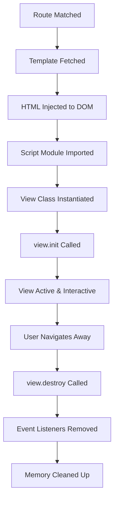

# View System

This document explains how views work in the web native routing system. Views are the building blocks of your application - each route corresponds to a view that handles both presentation and behavior.

## What is a View?

A **view** in this system consists of two parts:
1. **Template** (`template.html`) - The HTML content and structure
2. **Script** (`script.js`) - Optional JavaScript for interactivity and behavior

Think of views as self-contained mini-applications that get loaded on demand, with each view managing its own interactive behavior.

## View Directory Structure

Each view lives in its own folder under `views/`:

```
views/
├── home/
│   ├── template.html    # Required: HTML content
│   └── script.js        # Optional: Interactive behavior
├── about/
│   ├── template.html
│   └── script.js
└── contact/
    ├── template.html
    └── script.js
```

This structure provides:
- **Organization**: Everything for a route lives together
- **Lazy loading**: Only load code when needed
- **Maintainability**: Easy to find and modify view-specific code

## View Lifecycle

Every view goes through a predictable lifecycle:



### Lifecycle Phases

1. **Template Phase**: Static HTML loaded and displayed immediately
2. **Script Phase**: JavaScript module loaded and view class created
3. **Active Phase**: View handles user interactions and maintains state
4. **Cleanup Phase**: Resources released when navigating away

## Writing View Templates

Templates are standard HTML files that get injected into the `#content` element.

### Template Structure

```html
<!-- views/example/template.html -->
<section class="example-page">
    <h1>Example Page</h1>

    <div class="content">
        <p>This is the static content for the example page.</p>

        <!-- Interactive elements that will be handled by script.js -->
        <button data-action="click-example" class="btn btn-primary">
            Click Me
        </button>

        <div data-target="output">
            <!-- Dynamic content will appear here -->
        </div>
    </div>
</section>
```

### Template Guidelines

**Do**:
- Use semantic HTML elements
- Include data attributes for elements that need JavaScript interaction
- Structure content logically
- Use CSS classes for styling

**Don't**:
- Include `<html>`, `<head>`, or `<body>` tags
- Add inline JavaScript or styles
- Reference external scripts or stylesheets
- Use global JavaScript variables

## Writing View Scripts & Interactivity

View scripts are ES6 modules that export a class defining the view's interactive behavior and event handling.

### Basic View Class Structure

```javascript
// views/example/script.js
export default class ExampleView {
    constructor() {
        // Initialize properties
        this.buttonClickCount = 0;
        this.button = null;
        this.output = null;
    }

    /**
     * Initialize the view - called after template is loaded
     */
    init() {
        console.log('Example view initialized');

        // Find DOM elements
        this.button = document.querySelector('[data-action="click-example"]');
        this.output = document.querySelector('[data-target="output"]');

        // Set up event listeners
        if (this.button) {
            this.button.addEventListener('click', this.handleButtonClick.bind(this));
        }

        // Any other initialization
        this.updateDisplay();
    }

    /**
     * Cleanup when navigating away from this view
     */
    destroy() {
        console.log('Example view destroyed');

        // Remove event listeners
        if (this.button) {
            this.button.removeEventListener('click', this.handleButtonClick.bind(this));
        }

        // Clean up any timers, intervals, or other resources
        // Reset properties
        this.button = null;
        this.output = null;
    }

    /**
     * Handle button click events
     */
    handleButtonClick(event) {
        this.buttonClickCount++;
        this.updateDisplay();
    }

    /**
     * Update the display with current state
     */
    updateDisplay() {
        if (this.output) {
            this.output.innerHTML = `
                <p>Button clicked ${this.buttonClickCount} times</p>
            `;
        }
    }
}
```

## View Class Requirements

### Required Methods

**Constructor**
- Initialize properties and state
- Don't access DOM elements here (template not loaded yet)

**`init()`**
- Called after template is loaded into DOM
- Set up event listeners
- Initialize any dynamic behavior
- Access DOM elements safely

**`destroy()`**
- Called when navigating away from this view
- Remove all event listeners
- Clean up timers, intervals, observers
- Reset properties to prevent memory leaks

### Method Patterns

**Event Listener Setup**
```javascript
init() {
    // Store bound methods to enable removal
    this.handleClick = this.handleClick.bind(this);
    element.addEventListener('click', this.handleClick);
}

destroy() {
    // Remove the exact same function reference
    element.removeEventListener('click', this.handleClick);
}
```

## Adding a New View

Follow these steps to add a new route/view to your application:

### Step 1: Create View Directory
```bash
mkdir views/newpage
```

### Step 2: Create Template
```html
<!-- views/newpage/template.html -->
<section class="newpage">
    <h1>New Page</h1>
    <p>This is a new page in the application.</p>
</section>
```

### Step 3: Create Script (Optional)
```javascript
// views/newpage/script.js
export default class NewPageView {
    init() {
        console.log('New page view initialized');
        // Add any interactive behavior here
    }

    destroy() {
        console.log('New page view destroyed');
        // Clean up any resources here
    }
}
```

### Step 4: Register Route
```javascript
// js/app.js
router.addRoute('/newpage', 'newpage');
```

### Step 5: Add Navigation Link
```html
<!-- index.html -->
<li><a href="/newpage" class="nav-link" data-route>New Page</a></li>
```

That's it! Your new view is now accessible at `/newpage`.

## Error Handling in Views

### Template Errors
- Router continues if template fails to load
- Shows error page to user
- View script won't be loaded

### Script Errors
- Router continues if script fails to load
- Template still displays (graceful degradation)
- Error logged to console

## Common Pitfalls

### 1. Forgetting Event Listener Cleanup
```javascript
// ❌ Wrong - creates memory leaks
init() {
    document.addEventListener('click', () => {
        // This listener never gets removed!
    });
}

// ✅ Correct - proper cleanup
init() {
    this.handleClick = this.handleClick.bind(this);
    document.addEventListener('click', this.handleClick);
}

destroy() {
    document.removeEventListener('click', this.handleClick);
}
```

### 2. Accessing DOM Before Template Loads
```javascript
// ❌ Wrong - template not loaded yet
constructor() {
    this.button = document.getElementById('my-button'); // null!
}

// ✅ Correct - wait for init()
init() {
    this.button = document.getElementById('my-button'); // works!
}
```

### 3. Missing Export
```javascript
// ❌ Wrong - no export
class MyView {
    init() { /* ... */ }
}

// ✅ Correct - default export
export default class MyView {
    init() { /* ... */ }
}
```

## Summary

The view system provides:
- **Clear separation** between HTML and JavaScript
- **Lazy loading** of view-specific code
- **Proper lifecycle management** with init/destroy
- **Memory management** through cleanup
- **Organizational benefits** with directory structure

Understanding views is key to building maintainable applications with this routing system. Each view is a self-contained unit that manages its own presentation and behavior.
